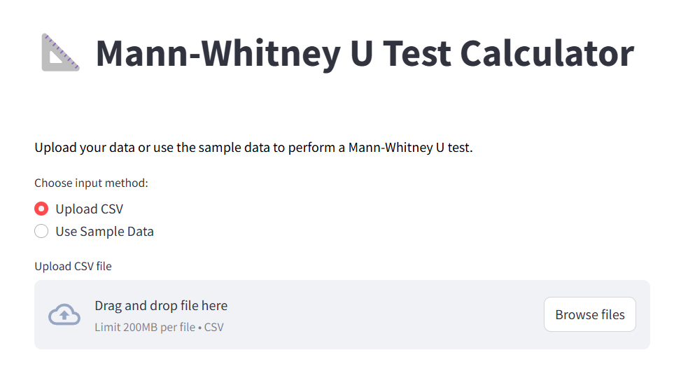

# Mann-Whitney U Test for GPA Analysis

This repository contains a **Streamlit** web app that allows users to perform a **Mann-Whitney U test** to compare the GPA distributions of two independent student groups (e.g., students who study at night vs. students who study during the day). The app provides a detailed step-by-step solution, including hypotheses, ranking, U-statistic calculation, and p-value interpretation.

[](https://mannutest.streamlit.app/)

---


---

### 🔍 **Project Overview**

The goal of this project is to determine whether the time of study (Night vs. Day) has an effect on student GPAs. The **Mann-Whitney U test**, a non-parametric test, is used to evaluate the differences between two independent groups when the assumptions of parametric tests (such as normality) are not met.

### 💻 **Technologies Used**

- **Python**: The core language for data manipulation and statistical testing.
- **Streamlit**: Used for creating an interactive web application.
- **SciPy**: Provides the `mannwhitneyu` function for performing the Mann-Whitney U test.
- **Pandas**: For data manipulation, including loading CSVs and performing data operations.
- **NumPy**: For numerical operations like ranking and statistical computations.
- **Matplotlib** and **Seaborn** (optional): For creating visualizations like boxplots and histograms to display the data distribution.

### 🛠 **Installation and Setup**

To run this app locally, follow the steps below:

#### 1. Clone the Repository
```
git clone https://github.com/rd89437/Mann_Whitney_U_Test.git
cd Mann_Whitney_U_Test
```

#### 2. Install Dependencies

```
pip install -r requirements.txt
```

#### 3. Run the App

```streamlit run app.py```

### 📊 How to Use the App

#### Input Method:

- Choose to upload your own CSV file or use the sample data provided.
- The file should contain two columns: one for the group (Night/Day) and one for GPA scores.

#### Select Columns:

- Once the data is loaded, select the group and value columns for analysis.
- The group column will define the two independent groups (e.g., Night vs. Day), and the value column should contain the GPA values.

#### Perform the Analysis:

- Click the “Perform Analysis” button to run the Mann-Whitney U test.
- The app will walk you through a detailed, step-by-step breakdown of the test, including calculating rank sums, U-statistics, and the p-value.
- Based on the p-value, the app will provide the conclusion, helping you determine if there is a significant difference between the two groups.

---

### ⚙️ How the Mann-Whitney U Test Works

The **Mann-Whitney U test** is used to compare the distributions of two independent groups:

- **Null Hypothesis (H₀)**: The two groups have identical distributions.
- **Alternative Hypothesis (H₁)**: The two groups have different distributions.

The app calculates the U-statistic and compares it to a critical value to determine if the observed difference is statistically significant (with a significance level of 0.05).

---

### 📄 Sample Data

The app comes with a sample dataset where two groups (Group A and Group B) are compared based on their GPA scores. This sample can be used to test the functionality of the app before uploading your own data.

---

### 📈 Visualizations

The app provides interactive visualizations to help you better understand the data distribution. You can view:

- **Boxplots**: To visually compare the GPA distributions between the two groups.
- **Ranking tables**: Showing how values are ranked and summed for both groups.

